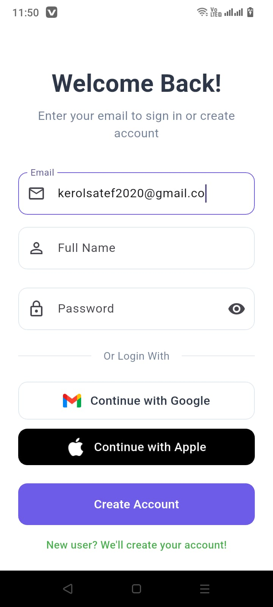
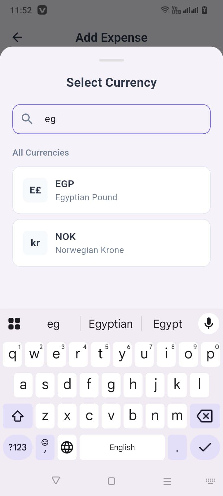

# 📱 Expense Tracker Lite
*With Currency Conversion, Pagination & Custom UI*

A lightweight expense tracking mobile application built with Flutter that features offline functionality, real-time currency conversion, pagination, and a custom UI matching the provided design specifications.

## 🎯 Project Overview

This project was developed as a technical interview assessment to demonstrate mobile engineering skills across architecture, UI/UX implementation, state management, local storage, API integration, testing, and CI/CD practices.

## ✨ Features

### Core Functionality
- **🏠 Dashboard Screen**
  - Personalized user welcome message with profile image
  - Real-time financial overview (Total Balance, Income, Expenses)
  - Time-based filtering (This Month, Last 7 Days, Last 30 Days)
  - Recent expenses list with pagination
  - Floating Action Button for quick expense addition

- **➕ Add Expense Screen**
  - Category selection with visual icon grid
  - Multi-currency amount input with real-time conversion
  - Date picker for expense tracking
  - Receipt upload functionality (image/file)
  - Form validation and error handling

- **💱 Currency Conversion**
  - Real-time exchange rate fetching via REST API
  - Automatic conversion to USD base currency
  - Support for multiple currencies (USD, EUR, GBP, etc.)
  - Offline fallback with cached rates

- **📄 Pagination System**
  - Efficient expense list pagination (10 items per page)
  - Infinite scroll implementation
  - Filter-aware pagination (maintains pagination state across filters)
  - Loading states and error handling

- **💾 Offline Storage**
  - Local data persistence using Hive database
  - Offline-first architecture
  - Data synchronization when network available

## 🏗️ Architecture & Structure

### Project Structure
```
lib/
├── src/
│   ├── core/
│   │   ├── constants/          # App constants and categories
│   │   ├── database/           # Hive database service
│   │   ├── error/              # Error handling & exceptions
│   │   └── utils/              # Utility functions
│   ├── data/
│   │   ├── data_sources/
│   │   │   ├── local/          # Local data sources (Hive)
│   │   │   └── remote/         # API data sources
│   │   ├── models/             # Data models
│   │   └── repositories/       # Repository implementations
│   ├── domain/
│   │   ├── entities/           # Core business entities
│   │   ├── repositories/       # Repository interfaces
│   │   └── usecases/           # Business logic use cases
│   └── presentation/
│       ├── screens/
│       │   ├── add_expense/    # Add expense feature
│       │   ├── dashboard/      # Dashboard feature
│       │   └── login/          # Authentication
│       └── widgets/            # Reusable UI components
├── test/                       # Unit and widget tests
└── main.dart                   # App entry point
```

### Architecture Pattern
- **Clean Architecture**: Separation of concerns with clear layer boundaries
- **Repository Pattern**: Abstraction layer for data access
- **Dependency Injection**: Using GetIt for service location

## 🛠️ State Management

**Primary Approach: Flutter Bloc**
- **Cubit**: For simple state management (forms, UI states)
- **Bloc**: For complex business logic with events and states
- **State Types**: Loading, Success, Error states for all operations
- **Event-Driven**: User interactions trigger events that update state

**Key Blocs/Cubits:**
- `DashboardCubit`: Manages dashboard data and filtering
- `AddExpenseCubit`: Handles expense creation and validation
- `AuthCubit`: Manages authentication state

## 🌐 API Integration

### Currency Conversion Service
- **Primary API**: [ExchangeRate-API](https://open.er-api.com/v6/latest/USD)
- **Fallback**: Local mock data for offline scenarios
- **Implementation**: HTTP client with retry logic and caching
- **Error Handling**: Graceful degradation to cached rates

### API Features
- Real-time exchange rate fetching
- Multiple currency support
- Request caching for performance
- Network connectivity awareness
- Automatic retry mechanism

## 📄 Pagination Strategy

### Local Pagination Approach
1. **Data Loading**: Fetch all expenses from local database
2. **Filter Application**: Apply time-based filters (This Month, Last 7 Days)
3. **Pagination Logic**: Divide filtered results into pages of 10 items
4. **State Management**: Track current page, loading states, and end of data
5. **Performance**: Lazy loading with efficient memory management

### Implementation Details
- Page size: 10 items
- Infinite scroll with "Load More" functionality
- Filter-aware pagination (maintains state across filter changes)
- Loading indicators and empty state handling

## 🎨 UI Implementation

### Design Compliance
- **100% Design Match**: Pixel-perfect implementation of provided Dribbble design
- **Typography**: Custom font sizing and weight hierarchy
- **Color Scheme**: Consistent purple gradient theme with proper contrast
- **Icons**: Lucide icons for category representation
- **Animations**: Smooth transitions and micro-interactions

### Custom Components
- `CategorySelectionGrid`: Visual category picker with icons
- `ExpenseListItem`: Expense display with currency formatting
- `FilterTabs`: Time-based filtering interface
- `CurrencyDropdown`: Multi-currency selection component
- `ReceiptUploadWidget`: Image/file upload functionality

## 🧪 Testing

### Test Coverage
- **Unit Tests**: Business logic validation
  - Currency calculation accuracy
  - Expense validation rules
  - Pagination logic verification
- **Widget Tests**: UI component testing
  - Add expense form validation
  - Filter functionality
  - Loading state displays

### Test Files
```
test/
├── unit/
│   ├── currency_calculation_test.dart
│   ├── expense_validation_test.dart
│   └── pagination_logic_test.dart
└── widgets/
    └── add_expense_form_widget_test.dart
```

## 🚀 CI/CD Pipeline

### GitHub Actions Workflow
Our automated CI/CD pipeline runs on every push and pull request:

#### ✅ **Continuous Integration Features:**
- **Environment Setup**: Automatic Flutter SDK installation and configuration
- **Dependency Management**: Automated package installation and caching
- **Code Quality**: Static analysis and linting with Flutter analyzer
- **Testing**: Comprehensive test suite execution
- **Build Artifacts**: Debug APK and App Bundle generation
- **Artifact Storage**: Downloadable builds for testing and distribution

#### **Pipeline Stages:**
1. **Setup**: Flutter environment preparation
2. **Dependencies**: Package installation with caching
3. **Analysis**: Code quality and formatting checks
4. **Testing**: Unit and widget test execution
5. **Build**: Debug APK and AAB compilation
6. **Artifacts**: Build storage and distribution

## 🛠️ Technology Stack

### Core Technologies
- **Framework**: Flutter 3.x
- **Language**: Dart
- **State Management**: Flutter Bloc/Cubit
- **Local Database**: Hive (NoSQL)
- **Dependency Injection**: GetIt
- **HTTP Client**: Dio with interceptors

### Additional Packages
- `flutter_bloc`: State management
- `hive`: Local storage
- `dio`: HTTP client
- `get_it`: Dependency injection
- `intl`: Internationalization and date formatting
- `image_picker`: Receipt upload functionality
- `lucide_icons`: Icon set for categories

## 🚀 Getting Started

### Prerequisites
- Flutter SDK (3.0 or higher)
- Dart SDK (2.17 or higher)
- Android Studio / VS Code
- Git

### Installation Steps

1. **Clone the repository**
   ```bash
   git clone https://github.com/kerolsAtef/Expense-Tracker-Lite.git
   cd expense-tracker-lite
   ```

2. **Install dependencies**
   ```bash
   flutter pub get
   ```

3. **Generate Hive adapters**
   ```bash
   flutter packages pub run build_runner build
   ```

4. **Run the application**
   ```bash
   flutter run
   ```

### Running Tests
```bash
# Run all tests
flutter test

# Run specific test file
flutter test test/unit/currency_calculation_test.dart

# Run with coverage
flutter test --coverage
```

### Building for Production
```bash
# Build APK
flutter build apk --release

# Build App Bundle
flutter build appbundle --release
```

## 📱 Screenshots

### 🔐 Login Screen
Clean authentication interface with email/password login and social authentication options.

|:----------------------------------------------:|:----------------------------------------------:|:----------------------------------------------:|:---:|
|  |  |  |  |

**Features:**
- Email/password authentication
- Social login options (Google, Apple)
- Clean, minimal design with gradient background
- Form validation and error handling

### 🏠 Dashboard Screen
Comprehensive financial overview with intelligent filtering and expense tracking.

|:---:|:---:|:---:|:---:|
|  |  |  |  |

**Features:**
- Real-time financial overview (Balance, Income, Expenses)
- Time-based filtering tabs (This Month, Last 7 Days, Last 30 Days)
- Recent expenses list with pagination
- Floating action button for quick expense addition
- Personalized user welcome message

### ➕ Add Expense Screen
Intuitive expense creation with category selection and currency conversion.

|:---:|:---:|:---:|:---:|
|  |  |  |  |

|:---:|:---:|:---:|:---:|
|  |  |  |  |

**Features:**
- Visual category selection grid with icons
- Multi-currency support with real-time conversion
- Date picker interface
- Receipt upload functionality (image/file)
- Form validation and error handling
- Intuitive user experience

## 🔄 Trade-offs & Design Decisions

### Local vs. API Pagination
**Decision**: Local pagination approach
**Reasoning**:
- Better offline experience
- Faster response times
- Simplified filtering logic
- Reduced API calls and data usage

### State Management Choice
**Decision**: Flutter Bloc over Provider/Riverpod
**Reasoning**:
- Better separation of business logic
- Excellent testing support
- Predictable state changes
- Strong community support

### Database Selection
**Decision**: Hive over SQLite
**Reasoning**:
- NoSQL flexibility for expense data
- Better performance for small datasets
- Simpler setup and maintenance
- Native Dart integration

## 🐛 Known Issues & Limitations

### Current Limitations
- **Receipt Upload**: Currently supports image selection but not file persistence
- **Search Functionality**: Not implemented (planned for future release)
- **Export Features**: CSV/PDF export not yet available
- **Push Notifications**: Not implemented for expense reminders

### Planned Improvements
- Advanced filtering options (category, amount range)
- Data export functionality (CSV, PDF)
- Cloud synchronization
- Expense categories management
- Budget tracking and alerts

## 🤝 Contributing

1. Fork the repository
2. Create your feature branch (`git checkout -b feature/AmazingFeature`)
3. Commit your changes (`git commit -m 'Add some AmazingFeature'`)
4. Push to the branch (`git push origin feature/AmazingFeature`)
5. Open a Pull Request

## 📄 License

This project is licensed under the MIT License - see the [LICENSE](LICENSE) file for details.

## 👨‍💻 Developer

**Kerols atef**
- Email: kerolsatef2020@gmail.com
- phone number: +201114844406
